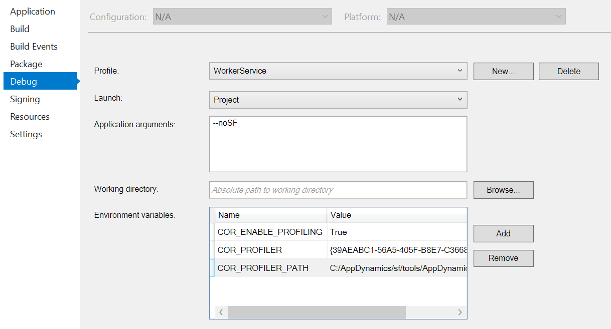

# App Dynamics Test Project

The purpose of this project is to test App Dynamics Transaction Monitoring
over RabbitMQ between Services Running in Service Fabric.

This project can also be run outside of Service Fabric.

## Install Required Software

Install Service Fabric SDK: Refer to [SF Documentation](https://docs.microsoft.com/en-us/azure/service-fabric/service-fabric-get-started)

Install RabbitMQ: Refer to [RabbitMQ Documentation](https://www.rabbitmq.com/download.html)

This sample requires at least .Net Framework 4.7.1.

## Configure RabbitMQ Credentials

Open `Program.cs` in both the `WebApi` and `WorkerService` and configure the

* RabbitMQ Host,
* RabbitMQ UserName,
* RabbitMQ Password

## Install the AppD Service Fabric Agent

Download the SF Agent: [NuGet](https://www.nuget.org/packages/AppDynamics.Agent.Distrib.Micro.Windows/)

Unzip the NuGet, ex: `C:\AppDynamics\sf`

Open the `ServiceManifest.xml` in both the `WebApi` and `WorkerService` and configure the

* Environment Variable: `COR_PROFILER_PATH` to point to the folder above.

## Configure AppD Account Details

Open both `WorkerService.AppDynamicsConfig.json` and `WebApi.AppDynamicsConfig.json` and
configure the relevant account parameters.

## Deploy to SF

Open the solution in Visual Studio and make sure that the `TestApplication` Project is
selected as the Startup Project. Make sure that build configuration is set to
`Debug` and `x64`.

Simply Run or Debug the Project.

## Run without SF

The two services can also be run without deploying to SF.

Additional configuration needs to be done in VS.

Open the Project Properties for both the `WebApi` and `WorkerService` projects and
make sure that `--noSF` is added under `Debug->Application Arguments`

Also make sure that the Environment Variables for the Profiler is added.
The Environment Variables should be the same as configured in the `ServiceManifest.xml`.

Finally set both `WebApi` and `WorkerService` as Startup Projects and Run or Debug the solution.

## Log Files

NLog will output log files to: `c:\Logs`. This can be configured in `NLog.config`

## Invoking the API

Open a browser: <http://localhost:5000/api/values/1>

This will send a Request Message from `WebApi` to `WorkerService`.
The `WorkerService` will then send a response message back containing a random value.